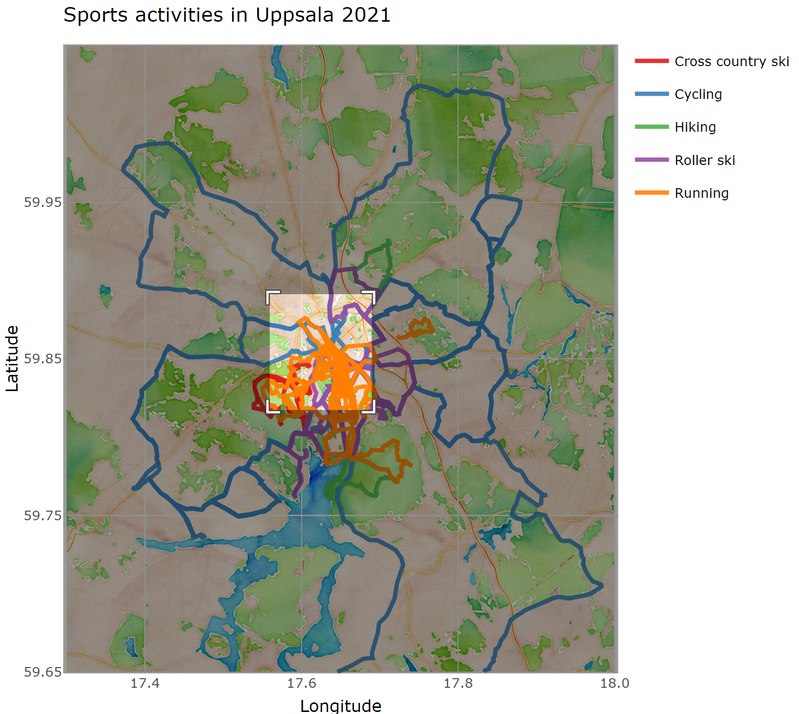
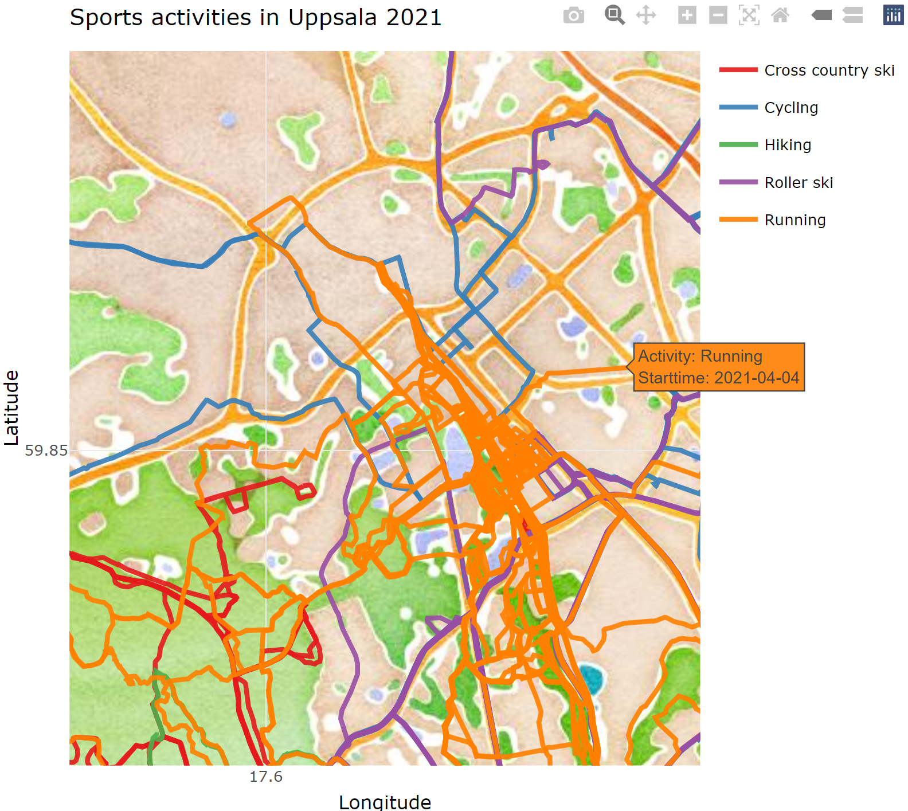

gpx\_plotter
================

The goal of gpx\_plotter is to plot GPS data from multiple .gpx files
onto a map. Gpx files used below were sports activities during 2020 -
2021 in Uppsala. Output files from the script are:

-   .png/.pdf maps
-   .gif (animation)
-   .html (interactive plotly html)

# .pdf/.png map


# .gif map

<!-- -->

# .html map

The .html map can be zoomed in and when hovering over activities the
activity type and start time are shown.



# Usage

The script reads .gpx files in the `data_gpx` folder into a tibble
(`df`) with longitude, latitude, time, activity and id.

``` r
df %>% 
  select(lat, lon, time, activity, id) %>% 
  group_by(id) %>% 
  slice_head(n = 4) %>% 
  head(20)
```

    ## # A tibble: 20 x 5
    ## # Groups:   id [5]
    ##      lat   lon time                activity    id
    ##    <dbl> <dbl> <dttm>              <chr>    <int>
    ##  1  59.8  17.7 2021-01-04 13:52:49 Running      1
    ##  2  59.9  17.7 2021-01-04 13:52:50 Running      1
    ##  3  59.9  17.7 2021-01-04 13:52:56 Running      1
    ##  4  59.9  17.7 2021-01-04 13:52:59 Running      1
    ##  5  59.8  17.7 2021-01-06 10:31:57 Running      2
    ##  6  59.8  17.7 2021-01-06 10:31:58 Running      2
    ##  7  59.8  17.7 2021-01-06 10:32:01 Running      2
    ##  8  59.8  17.7 2021-01-06 10:32:02 Running      2
    ##  9  59.8  17.7 2021-01-08 16:35:38 Running      3
    ## 10  59.8  17.7 2021-01-08 16:35:40 Running      3
    ## 11  59.8  17.7 2021-01-08 16:35:46 Running      3
    ## 12  59.8  17.7 2021-01-08 16:35:47 Running      3
    ## 13  59.8  17.7 2021-01-09 14:19:26 Running      4
    ## 14  59.8  17.7 2021-01-09 14:19:27 Running      4
    ## 15  59.8  17.7 2021-01-09 14:19:30 Running      4
    ## 16  59.8  17.7 2021-01-09 14:19:31 Running      4
    ## 17  59.9  17.7 2021-01-12 18:50:22 Running      5
    ## 18  59.9  17.7 2021-01-12 18:50:23 Running      5
    ## 19  59.9  17.7 2021-01-12 18:50:25 Running      5
    ## 20  59.9  17.7 2021-01-12 18:50:26 Running      5

The map can be zoomed by adjusting the latitude (`set_latitude`) and
longitude (`set_latitude`) parameters. The map type is changed with the
`get_stamenmap` function. Below are three example maps:


Planned tasks in the project is to make it into an [R
package](https://r-pkgs.org/) and [R
Shiny](https://mastering-shiny.org/) app.
