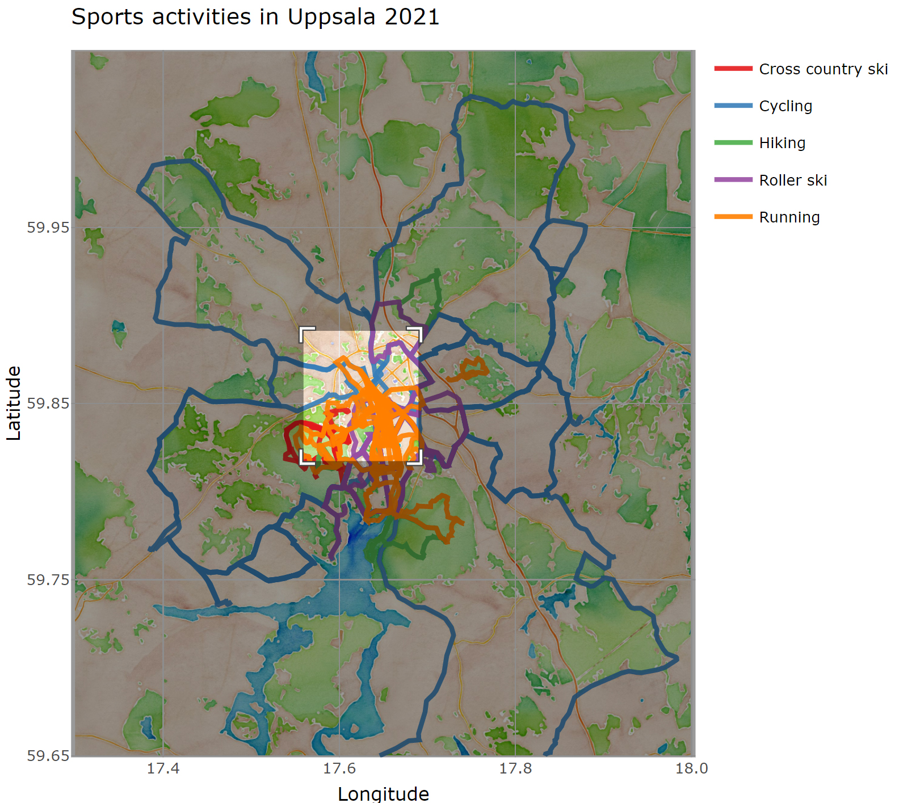

```{r setup, include = FALSE}
library(tidyverse)
library(plotly)
library(htmlwidgets)
library(ggmap)
library(ggpubr)
load("./output/data.Rdata")
```

The goal of gpx_plotter is to plot GPS data from multiple .gpx files onto a map. Gpx files used below were sports activities during 2020 - 2021 in Uppsala. [Output files](https://github.com/kpullerits/gpx_plotter/tree/main/output) from the [script](https://github.com/kpullerits/gpx_plotter/blob/main/script/gpx_plotter_script.R) are:

* .png/.pdf maps
* .gif (animation)
* .html (interactive plotly html)

# .pdf/.png map

```{r, echo = FALSE}
knitr::include_graphics("./output/map.png")
```

# .gif map

```{r, echo = FALSE}
knitr::include_graphics("./output/map.gif")
```

# .html map

The .html map can be zoomed in and when hovering over activities the activity type and start time are shown.

```{r, echo=FALSE}

knitr::include_graphics("./README_figures/html_map2.jpg")
```

# Usage

The script reads .gpx files in the `data_gpx` folder into a tibble (`df`) with longitude, latitude, time, activity and id.

```{r}
df %>% 
  select(lat, lon, time, activity, id) %>% 
  group_by(id) %>% 
  slice_head(n = 4) %>% 
  head(20)
```

The map can be zoomed by adjusting the latitude (`set_latitude`) and longitude (`set_latitude`) parameters. The map type is changed with the `get_stamenmap` function. Below are three example maps:

```{r, echo = FALSE, message = FALSE}
maptypes <- c("terrain",
            "terrain-background", "terrain-labels", "terrain-lines", "toner",
            "toner-2010", "toner-2011", "toner-background", "toner-hybrid",
            "toner-labels", "toner-lines", "toner-lite", "watercolor")
set_longitude = c(17.3, 18)
set_latitude = c(59.65, 60.05)

maps <- list()
for (maptype in c(maptypes[13], maptypes[1], maptypes[5])) {
  map <- get_stamenmap(
  bbox = c(left = set_longitude[1], right = set_longitude[2],
           bottom = set_latitude[1], top = set_latitude[2]),
  maptype = maptype,
  zoom = 12
  
)
  maps[[maptype]] <- map

}
map1 <- ggmap(maps[[1]]) + labs(title = names(maps[1]), x = "Longitude", y = "Latitude")
map2 <- ggmap(maps[[2]]) + labs(title = names(maps[2]), x = "Longitude", y = "Latitude")
map3 <- ggmap(maps[[3]]) + labs(title = names(maps[3]), x = "Longitude", y = "Latitude")


p_maps <- ggarrange(map1, map2, map3, nrow = 1)
ggsave(p_maps, path = "README_figures", filename = "readme_maps.png", device = "png", width = 12, height = 3)

```

```{r, echo=FALSE}
knitr::include_graphics("./README_figures/readme_maps.png")
```


Planned tasks in the project is to make it into an [R package](https://r-pkgs.org/) and [R Shiny](https://mastering-shiny.org/) app.

